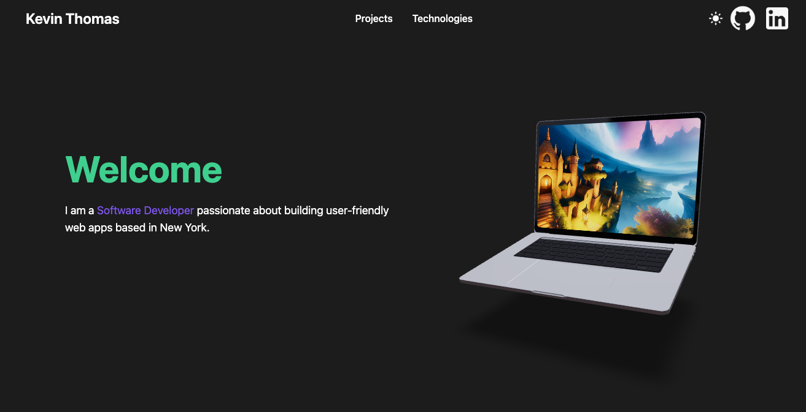
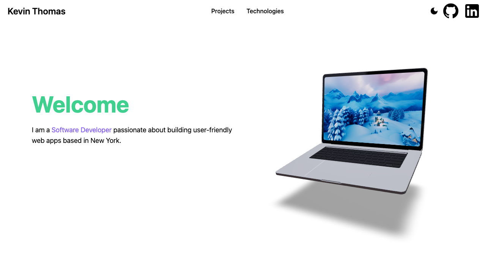

# Kevin Thomas Portfolio

## Website Link: [Click Here](https://kevinthomas.vercel.app/)

## Table of Contents

- [Introduction](#introduction)
- [Technologies](#technologies)
- [Features](#features)

## Introduction

This portfolio website is created to showcase my skills and recent projects. Visitors can easily navigate through my projects and get a glimpse of my skills and experience.

## Technologies

This website is built using the following technologies:

- [React](https://reactjs.org/)
- [React-three-fiber](https://github.com/pmndrs/react-three-fiber)
- [Tailwind CSS](https://tailwindcss.com/)

## Features

This portfolio website includes the following features:

- The navigation bar includes a button to toggle light and dark mode.

  - Light Mode
    

  - Dark Mode
    
     

- The hero section contains a 3D laptop model. You can click on the laptop screen to rotate the image.

  
   

- The contact section allows users to rotate the image.

  
   
